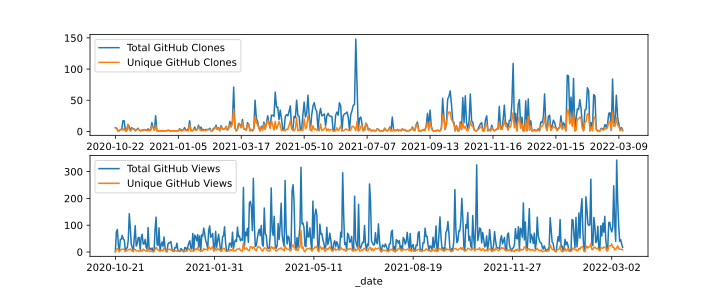

icepyx Adoption
===============
    
Estimating usage of open-source software is a fundamentally difficult task, and "easy" metrics like number of downloads 
`have the potential to be misleading <https://blog.dask.org/2020/01/14/estimating-users>`_.

We are excited by the enthusiastic adoption of icepyx by the ICESat-2 data user community, 
and despite these limitations in data tracking metrics, we have begun (November 2020) to track user downloads and page views as shown below.

GitHub Traffic
^^^^^^^^^^^^^^
Clones and views of the icepyx library directly on GitHub.

PyPI Downloads
^^^^^^^^^^^^^^
Non-mirrored downloads of icepyx from the `Python Package Index <https://pypi.org/>`_ (e.g. using `pip install icepyx`).

.. image:: pypistats/downloads.svg
  :width: 600
  :alt: Figure showing the number of downloads of the icepyx library from the Python Package Index by non-mirroring sites since the package became available through that index.
