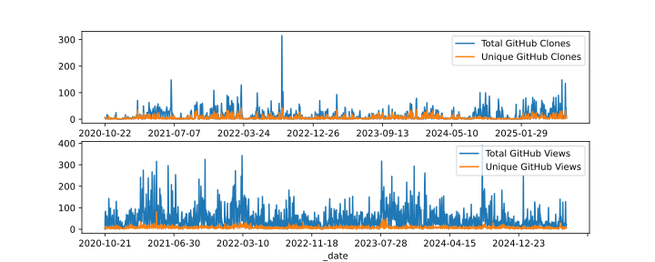
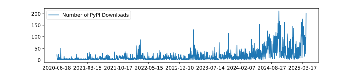

icepyx Adoption
===============
    
Estimating usage of open-source software is a fundamentally difficult task, and "easy" metrics like number of downloads 
`have the potential to be misleading <https://blog.dask.org/2020/01/14/estimating-users>`_.

We are excited by the enthusiastic adoption of icepyx by the ICESat-2 data user community, 
and despite these limitations in data tracking metrics, we have begun (November 2020) to track aggregate user downloads and page views as shown below.

Although technologies exist, to respect user privacy and international regulations (without requiring browser cookies), 
we intentionally do not track the IP addresses of users accessing our code or documentation.
As a result, we are unable to view usage statistics for specific pages/examples or repeat visitors.
If you find certain materials especially helpful, we'd appreciate :ref:`hearing from you<contact_ref_label>`!

GitHub Traffic
^^^^^^^^^^^^^^
Clones and views of the icepyx library directly on GitHub.

PyPI Downloads
^^^^^^^^^^^^^^
Non-mirrored downloads of icepyx from the `Python Package Index <https://pypi.org/>`_ (e.g. using `pip install icepyx`).

