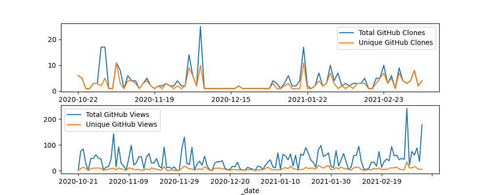
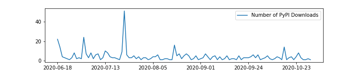

Tracking icepyx Usage
======================

How is icepyx being used by the ICESat-2 data user community?

Projects and Organizations
--------------------------
Projects and organizations that use icepyx (this list is still being populated as of Nov 2020)

- `NSIDC <https://nsidc.org/data/icesat-2/tools>`_
- `University of Washington e-Science institute <https://escience.washington.edu/>`_
- `ICESat-2 Cryospheric Hackweeks <https://icesat-2hackweek.github.io/learning-resources/>`_
- `Colorado School of Mines Glaciology Laboratory <https://github.com/MinesGlaciology>`_

Publications and Presentations
------------------------------
ICESat-2 peer-reviewed research that utilizes icepyx and presentations that feature or explain icepyx

.. bibliography:: icepyx_pubs.bib
    :style: mystyle
    :all:
    
    
Downloads
---------
Estimating usage of open-source software is a fundamentally difficult task, and "easy" metrics like number of downloads `have the potential to be misleading <https://blog.dask.org/2020/01/14/estimating-users>`_. For icepyx, the number of library downloads further cannot completely capture usage because it is likely downloaded once and then used for multiple data download or analysis sessions.

We are excited by the enthusiastic adoption of icepyx by the ICESat-2 data user community, and despite these limitations in data tracking metrics, we have begun (November 2020) to track user downloads and page views as shown below.

GitHub Traffic
^^^^^^^^^^^^^^
Clones and views of the icepyx library directly on GitHub.

PyPI Downloads
^^^^^^^^^^^^^^
Non-mirrored downloads of icepyx from the `Python Package Index <https://pypi.org/>`_ (e.g. using `pip install icepyx`).

