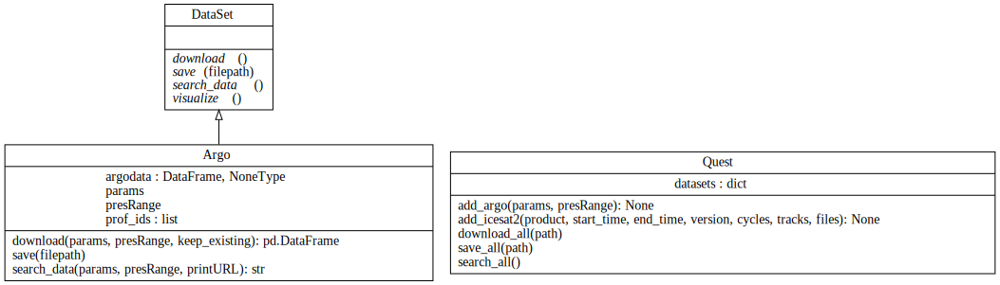

.. _api_doc_ref_q:

icepyx-QUEST Documentation (API Reference)
==========================================

QUEST and icepyx share the top-level GenQuery class.
The documentation for GenQuery are within icepyx.Query (<icepyx.GenQuery>).

Class diagram illustrating the QUEST component's of icepyx's
public-facing classes, their attributes and methods, and their relationships.
A more detailed, developer UML class diagram showing hidden parameters is available on GitHub in the ``icepyx/doc/source/user_guide/documentation/`` directory.
Diagrams are updated automatically after a pull request (PR) is approved and before it is merged to the development branch.

.. toctree::
    :maxdepth: 1

   quest
