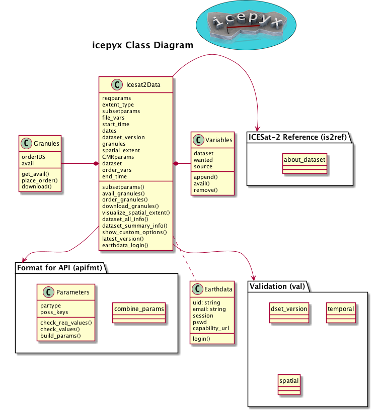

icepyx API Reference
====================

icepyx class diagram illustrating the library's public-facing classes, their attributes and functions, and their relationships.

.. toctree::

   icesat2data
   components
