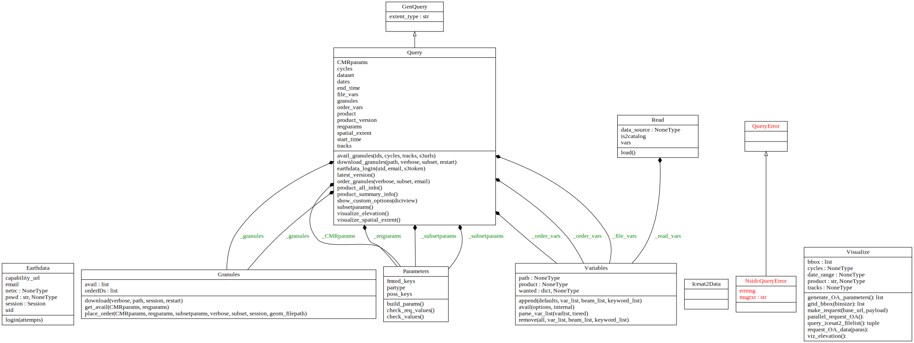

.. _api_doc_ref:

icepyx Documentation (API)
==========================

icepyx class diagram illustrating the library's public-facing classes, their attributes and methods, and their relationships.
Additional UML diagrams, including a more detailed, developer UML class diagram showing hidden parameters,
are available on `GitHub in the icepyx/doc/source/user_guide/documentation/ directory <https://github.com/icesat2py/icepyx/tree/development/doc/source/user_guide/documentation>`_.
Diagrams are updated automatically after a pull request (PR) is approved and before it is merged to the development branch.

.. toctree::
   :maxdepth: 1

   query
   read
   variables
   components
