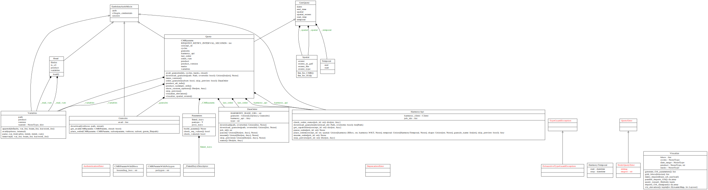

.. _api_doc_ref:

icepyx Documentation (API Reference)
====================================

.. image:: packages_user_uml.svg
  :width: 600
  :alt: UML package Diagram illustrating the public-facing, high-level packages within icepyx and their relationships.

icepyx package diagram illustrating the library's public-facing, high-level package structure and their relationships.

icepyx class diagram illustrating the library's public-facing classes, their attributes and methods, and their relationships.
A more detailed, developer UML class diagram showing hidden parameters is available on GitHub in the ``icepyx/doc/source/user_guide/documentation/`` directory.
Diagrams are updated automatically after a pull request (PR) is approved and before it is merged to the development branch.

.. toctree::

   query
   read
   components