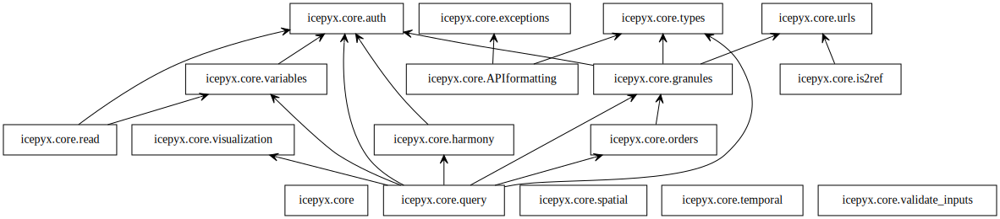

.. _api_doc_ref:

Contribution Guidelines
=======================

Welcome to the icepyx community, and thank you for your interest in contributing to icepyx! We welcome and invite contributions of any size from anyone at any career stage and with any amount of coding experience. Since this is a community-based project, we're thankful for your contributions to the utility and success of this project.

Here we provide a set of guidelines and information for contributing to icepyx. This project is released with a Contributor Code of Conduct. By participating in this project you agree to abide by its terms. |Contributor Covenant|

.. |Contributor Covenant| image:: https://img.shields.io/badge/Contributor%20Covenant-v2.0%20adopted-ff69b4.svg
   :target: ../../../code_of_conduct.md
   
Steps for contributing code
---------------------------

On this page we briefly provide steps for contributing code to icepyx. You may have an idea for improving existing structure, or wish to add an ancillary dataset through our QUEST module. In all cases, please follow the guidelines below. 

1. Sign up for a GitHub account

2. Clone the icepyx repo

3. Create a new temporary branch off development 

4. Add your name (in alphabetical order) to the contributors list

5. Submit a pull request of your temporary branch into development. You're officially part of our community!

6. For all future code contributions, create a new branch from the development branch and work from this branch. 

More details following each of these steps follow:

1. Sign up for your github account (visit https://github.com/ and  ‘sign up for GitHub account’)
2. For the purposes of adding your name to the contributors list, you need to create a new branch. You can do this by clicking the down arrow next to ‘development’ and making a new branch titled ‘new_contributor’ (or whatever you want to name it - the naming doesn't matter much as it will only be a temporary branch). 
3. Navigate to the new branch you created, click on CONTRIBUTORS.rst, and edit the document by adding your name in alphabetical order. After you do this, commit your changes and add a commit message ‘Added [your name here] to contributors list.’ 
4. After committing the changes, open a pull request to merge your branch into the development branch. Members of the icepyx community will review these changes.
5. After you’ve added yourself to the contributors list, clone the icepyx repo by navigating to `icepyx <https://github.com/icesat2py/icepyx>`__, clicking on the green ‘code’ button, copying the https link, then in your terminal where you want the folder, type:

        git clone https://github.com/icesat2py/icepyx.
Create a new branch within this cloned repo for the project you are working on. Work from this branch and regularly create pull requests to merge it with the development branch. 

For help navigating git and github, see this `guide <https://the-turing-way.netlify.app/collaboration/github-novice/github-novice-firststeps.html?highlight=github%20account>`__.

Ways to Contribute
------------------

- Share your use cases and examples (as Jupyter Notebooks, scripts, etc.)
- Submit bug reports and feature requests
- Write code for everyone to use
- Contribute an ancillary dataset within QUEST 
- Fix typos
- Improve documentation and testing

The best way to report a problem, request a feature, find out if others are working on a similar problem or application, or let us know you'd like to contribute some code is to find the *Issues* tab and check if your problem/suggestion has already been reported. If so, please provide any additional information in the ongoing discussion. Otherwise, feel free to create a new issue and submit your problem or suggestions.

Requesting a Feature
--------------------
Find the *Issues* tab at the top of GitHub repository and click *New Issue* button. Please give your suggestion a clear title and let us know if this is something you'd like to work on and contribute.

Reporting a Bug
---------------
Find the *Issues* tab at the top of GitHub repository and click *New Issue* button. Give your issue a clear title and describe the steps required to recreate it in as much detail as possible. If you can, include a small example that reproduces the error. More information and minimal examples will help us resolve issues faster.

Questions and Help
------------------

Please do not create issues to ask for help. A faster way to reach the community is through our Science/ICESat-2 subcategory on the `Pangeo discourse <https://discourse.pangeo.io/c/science/icesat-2/16>`_ page. We are excited to have you join an existing conversation or start a new post! Please note that a GitHub login is required to post on the discourse page.

Other Resources
^^^^^^^^^^^^^^^
- Check out our :ref:`ICESat-2 Open-Source Resources Guide<resource_ref_label>` for a host of tools and code for getting and working with ICESat-2 data
- The `2019 ICESat-2 Hackweek Tutorial repo <https://github.com/ICESAT-2HackWeek/ICESat2_hackweek_tutorials>`_ and [in progress] `2020 ICESat-2 Hackweek  Tutorial repo <https://github.com/ICESAT-2HackWeek/2020_ICESat-2_Hackweek_Tutorials>`_ are great resources for learning basic Python and development skills, learning about ICESat-2 data, setting up a computational environment, and finding and analyzing ICESat-2 datasets.
- A great set of `interactive tutorials <https://learngitbranching.js.org>`_ for learning and practicing using git
- Let us know about the helpful tools you've found by posting on our discourse forum as indicated above (`Questions and Help`_)!

Adding Examples
---------------
We are delighted you'd like to contribute your `icepyx <https://github.com/icesat2py/icepyx>`_ example! Examples may be in the form of executable scripts or interactive Jupyter Notebooks. Please make sure that each example has a descriptive name so someone not familiar with your project understands its general behavior. Fully working examples should be submitted using a pull request to the "development" branch, following the steps outlined below for `Contributing Code`_.

Contributing Code
-----------------
We follow a standard git workflow for code changes and additions.
All submitted code, including our own, goes through the pull request process;
no changes are pushed directly to the *main* or *development* branches.
This allows our continuous integration (testing) process to ensure that the code is up to our standards and passes all of our tests (i.e. doesn't break what's already there and working).
By having a *development* branch for daily work, we enable the *main* branch to remain stable between releases even as new features are being added.

First Steps
^^^^^^^^^^^
Before you begin writing code, please first check out our issues page. Someone may already be working on the same problem, and you may be able to contribute directly to their efforts. If not, create a new issue to describe what you plan to do.

General Guidelines
^^^^^^^^^^^^^^^^^^

- Make each pull request as small and simple as possible. Unrelated changes should be submitted as multiple pull requests.
- Larger changes should be broken down into their basic components and integrated separately.
- Bug fixes should be their own pull requests.
- Do not commit changes to files irrelevant to your pull request, such as `.gitignore`
- Write descriptive commit and pull request messages. Someone looking at the code a decade from now should know what you worked on from your commit message.
- Be kind and encouraging to all contributors; be willing to accept constructive criticism to improve your code.
- Review of pull requests takes time, particularly if the pull request is large and/or the commit messages are ambiguous.

Basic Steps to Contribute
^^^^^^^^^^^^^^^^^^^^^^^^^
We encourage users to follow the `git pull request workflow <https://www.asmeurer.com/git-workflow/>`_. In a nutshell, the series of steps required to add new code is:
(first time only)

 - Clone the repository
 - Fork the repo to your personal GitHub account
 - Add your fork as a remote
 - Add yourself to `CONTRIBUTORS.rst` (see `Attribution for Contributions`_)

(each time you are going to make changes)

 - Update the development branch
 - Create a new branch
 - Make your changes and commit them to the branch
 - Push your changes to your fork
 - Make a pull request (on GitHub; pull requests will automatically be made against the development branch)
 - Push any additional, relevant changes to the same pull request (this will happen automatically if you push the changes to the same branch from which you made the pull request)

Licensing
^^^^^^^^^
icepyx is licensed under the `BSD-3 license <https://opensource.org/licenses/BSD-3-Clause>`_. Contributed code will also be licensed under BSD-3. If you did not write the code yourself, it is your responsibility to ensure that the existing license is compatible and included in the contributed files or you have documented permission from the original author to relicense the code.

icepyx Documentation (API Reference)
====================================

icepyx package diagram illustrating the library's public-facing, high-level package structure and their relationships.

.. image:: classes_user_uml.svg
  :width: 600
  :alt: UML Class Diagram illustrating the public-facing classes within icepyx, their attributes and methods, their relationships (e.g. component classes).

icepyx class diagram illustrating the library's public-facing classes, their attributes and methods, and their relationships.
A more detailed, developer UML class diagram showing hidden parameters is available on GitHub in the ``icepyx/doc/source/user_guide/documentation/`` directory.
Diagrams are updated automatically after a pull request (PR) is approved and before it is merged to the development branch.

.. toctree::

   query
   read
   quest
   components
